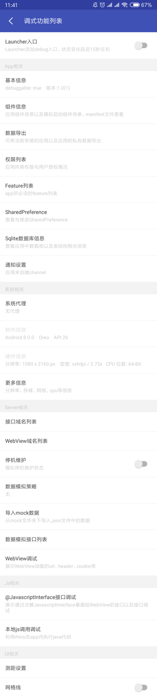

## debugger

```groovy
debugApi 'com.su:debugger.annotations:0.9.7'
debugAnnotationProcessor 'com.su:debugger.compiler:0.9.7'
debugImplementation 'com.su:debugger:0.9.7'
releaseImplementation 'com.su:debugger-no-op:0.9.7'
```

需要将module名称传给compiler

```groovy
defaultConfig {
    ...
    javaCompileOptions {
        annotationProcessorOptions {
            arguments = [MODULE_NAME: project.getName()]
        }
    }
}
```

您可以通过实现自己的`com.su.debugger.DebuggerSupplier`来改变策略。

初始化debugger

```java
private static void initDebugger(Application application) {
    if (BuildConfig.DEBUG) {
        Configuration configuration = new Configuration();
        configuration.setRequestSupplierClassname("您的DebuggerSupplier类名");
        Debugger.init(application, configuration);
    }
}
```

模拟activity传参跳转时，可以对activity进行如下类似配置

```java
@NoteComponent(description = "页面传参测试",
        type = "activity",
        parameters = {@Parameter(parameterName = "object", parameterClass = ObjectParameter.class, parameterRequired = false),
                @Parameter(parameterName = "objects", parameterClass = ObjectParameter[].class, parameterRequired = false),
                @Parameter(parameterName = "int", parameterClass = int.class),
                @Parameter(parameterName = "long", parameterClass = long.class, parameterRequired = false)})
```

其中`type`必须要指定为`activity`，参数不仅可以配置为基本数据类型也可以配置实现Parcelable的类型。

启动service也类似。


其中`getRequestBodyExcludeKeys`是下文提到的过滤特定的请求字段。

> {
> ​	"body": {
> ​		"random": "abc"
> ​	},
> ​	"traceId": "efg"
> }

例如，当您想过滤请求体中body字段下的random字段和traceId字段时，需要按如下格式覆盖此函数：

```java
@NonNull
@Override
public List<List<String>> getRequestBodyExcludeKeys() {
    List<List<String>> keys = new ArrayList<>();
    List<String> random = new ArrayList<>();
    random.add("body");
    random.add("random");
    keys.add(random);
    List<String> traceId = new ArrayList<>();
    traceId.add("traceId");
    keys.add(traceId);
    return keys;
}
```

在使用域名切换时，可以覆盖`urlMapping`来实现自己的url映射策略

使用`Server相关`的功能时，需要给OkHttp添加如下拦截器

```java
Object hostInterceptor = Debugger.getHostInterceptor();
if (hostInterceptor != null) {
    builder.addInterceptor((Interceptor) hostInterceptor);
}
Object mockInterceptor = Debugger.getMockInterceptor();
if (mockInterceptor != null) {
    builder.addInterceptor((Interceptor) mockInterceptor);
}
Object dataCollectorInterceptor = Debugger.getDataCollectorInterceptor();
if (dataCollectorInterceptor != null) {
    builder.addInterceptor((Interceptor) dataCollectorInterceptor);
}
```

`HostInterceptor`用于域名切换

`MockInterceptor`用于数据模拟

`DataCollectorInterceptor`用于自动收集数据

在WebView中切换域名时需要集成如下代码：

```java
String host = Debugger.getWebViewHost();
if (!TextUtils.isEmpty(host)) {
    DebuggerSupplier supplier = DebuggerSupplier.getInstance();
    if (supplier != null) {
        mUrl = supplier.urlMapping(mUrl, host);
    }
}
```


## 功能列表




可以通过上面的开关给调试模块在桌面上添加入口。

更多细节请参阅[wiki](https://github.com/su1216/debugger/wiki)
