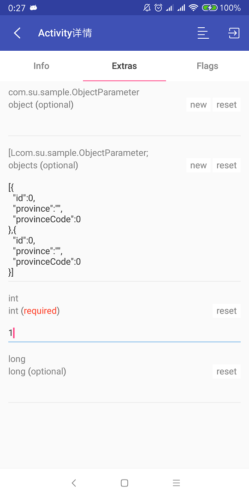
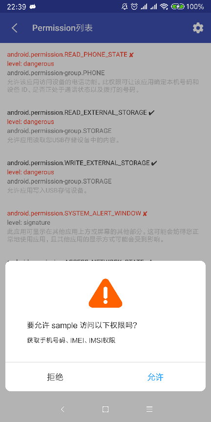
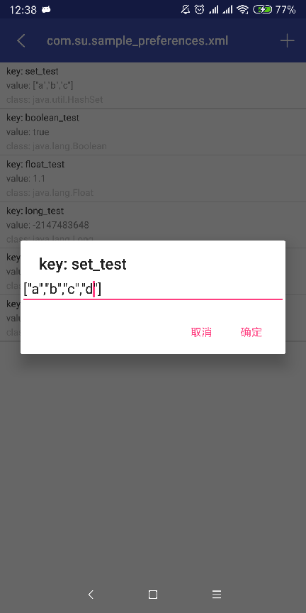
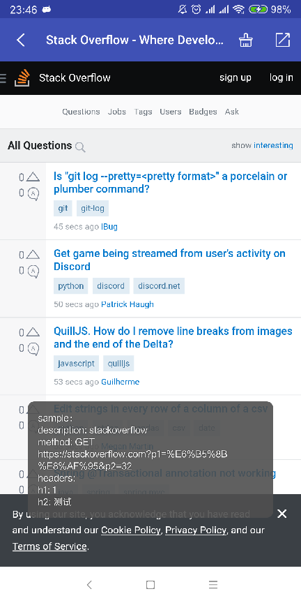
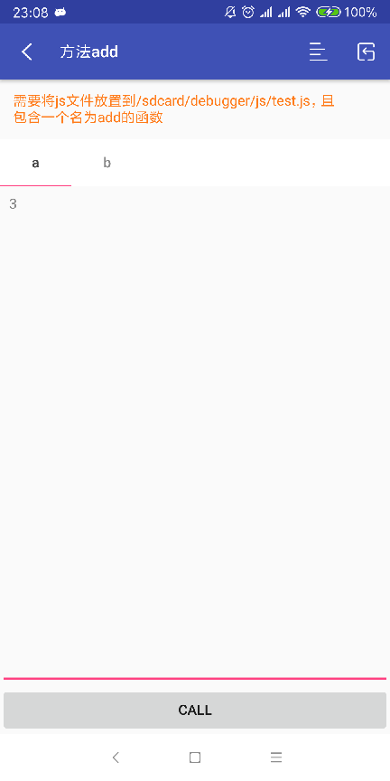

# debugger

## 集成说明

```groovy
debugApi 'com.su:debugger.annotations:0.9.2'
debugAnnotationProcessor 'com.su:debugger.compiler:0.9.2'
debugImplementation 'com.su:debugger:0.9.2'
releaseImplementation 'com.su:debugger-no-op:0.9.2'
```

需要将module名称传给compiler

```groovy
defaultConfig {
    ...
    javaCompileOptions {
        annotationProcessorOptions {
            arguments = [MODULE_NAME: project.getName()]
        }
    }
}
```

您可以通过实现自己的`com.su.debugger.DebuggerSupplier`来改变策略。

初始化debugger

```java
private static void initDebugger(Application application) {
    if (BuildConfig.DEBUG) {
        Configuration configuration = new Configuration();
        configuration.setRequestSupplierClassname("您的DebuggerSupplier类名");
        Debugger.init(application, configuration);
    }
}
```

模拟activity传参跳转时，可以对activity进行如下类似配置

```java
@NoteComponent(description = "页面传参测试",
        type = "activity",
        parameters = {@Parameter(parameterName = "object", parameterClass = ObjectParameter.class, parameterRequired = false),
                @Parameter(parameterName = "objects", parameterClass = ObjectParameter[].class, parameterRequired = false),
                @Parameter(parameterName = "int", parameterClass = int.class),
                @Parameter(parameterName = "long", parameterClass = long.class, parameterRequired = false)})
```

其中`type`必须要指定为`activity`，参数不仅可以配置为基本数据类型也可以配置实现Parcelable的类型。


`getRequestBodyExcludeKeys`可以过滤特定的请求字段。

> {
> ​	"body": {
> ​		"random": "abc"
> ​	},
> ​	"traceId": "efg"
> }

例如，当您想过滤请求体中body字段下的random字段和traceId字段时，需要按如下格式覆盖此函数：

```java
@NonNull
@Override
public List<List<String>> getRequestBodyExcludeKeys() {
    List<List<String>> keys = new ArrayList<>();
    List<String> random = new ArrayList<>();
    random.add("body");
    random.add("random");
    keys.add(random);
    List<String> traceId = new ArrayList<>();
    traceId.add("traceId");
    keys.add(traceId);
    return keys;
}
```

在使用域名切换时，可以覆盖`urlMapping`来实现自己的url映射策略

使用`Server相关`的功能时，需要给OkHttp添加如下拦截器

```java
Object environmentInterceptor = Debugger.getEnvironmentInterceptor();
if (environmentInterceptor != null && environmentInterceptor instanceof Interceptor) {
    builder.addInterceptor((Interceptor) environmentInterceptor);
}
Object mockInterceptor = Debugger.getMockInterceptor();
if (mockInterceptor != null && mockInterceptor instanceof Interceptor) {
    builder.addInterceptor((Interceptor) mockInterceptor);
}
Object dataCollectorInterceptor = Debugger.getDataCollectorInterceptor();
if (dataCollectorInterceptor != null && dataCollectorInterceptor instanceof Interceptor) {
    builder.addInterceptor((Interceptor) dataCollectorInterceptor);
}
```

`EnvironmentInterceptor`用于域名切换

`MockInterceptor`用于数据模拟

`DataCollectorInterceptor`用于自动收集数据

在WebView中切换域名时需要集成如下代码：

```java
String host = Debugger.getHost();
if (TextUtils.isEmpty(host)) {
    newUrl = DebuggerSupplier.getInstance().urlMapping(url, newHost);
}
```


下图为debugger完整功能列表


可以通过上面的开关给调试模块在桌面上添加入口。

## Part1

### 应用组件信息

这里可以查看应用的四大组件信息。

由于包名可能比较长，所以展示的时候，如果包名和manifest中声明的一致，则类名只显示包名之后的那一部分。并且在条目的最后会标明一个`缩`字。

activity列表中可以进行搜索，英文关键词使用空格分隔即可。其他的列表搜索基本和此页面规则一致。在四大组件列表中，`exported=true`和`enabled=false`的组件将被标红。
可以使用注解给activity配置mock参数，在activity详情页面中，选择参数列表tab后，可以通过右上角的按钮跳转到指定activity中。
如果给activity的参数不是基本类型，可以通过`new`按钮初始化对象json，当然，这里的对象需要实现`Parcelable`接口。没有使用注解给activity配置参数的页面，在activity详情中不会有多个tab。此时右上角也只有一个跳转按钮，但是能否跳转成功，完全取决activity是否没有必传参数。




### 权限列表

权限列表中，列出了你的app使用了哪些权限，哪些用户已经授权给你了，可以通过点击列表中的条目进行授权请求。



### SharedPreference

这里可以查看应用的所有SharedPreference文件，并且可以修改（这里禁止修改debugger本身的SharedPreference内容）。SharedPreference支持的6种数据类型（包括`Set<String>`）都支持修改。



## Part2

### 系统代理

这里可以查看系统Wifi代理设置，可以跳转到wifi设置页面，但是无法直接自动设置代理。

### 其他

这部分其余均为信息展示，内容包含系统各种软硬件信息。


## Part3

这部分绝大多数内容需要配合OkHttp才能使用

### 域名切换

这里可以统一切换域名，包括WebView部分。

### 停机维护

开启停机维护时，debugger可以对所有接口返回统一的json，以便模拟停机维护。

### 数据模拟

步骤：

1. 选择模拟策略

   策略分为三种：手动、手动+自动、无（即不进行模拟）

   


   debugger包含一个request自动收集器。它会将所有请求的request和response内容收集（不包含二进制部分）。收集的结果会存入本地数据库中。自动是只使用自动收集器收集回来的数据。

   手动是指使用通过修改自动收集器收集的数据、或者通过json导入到debugger中的模拟数据。mock详情页面可以对`mothod`、`request header`、`query`、`body`、`response header`、`response`修改，也可以设置此条数据是否为自动收集的数据。

2. 制造模拟数据

   制造数据可以通过上面提到的自动收集器，也可以将mock数据的编辑json保存到以下两个目录中的一个：

   ```
   /storage/emulated/0/Android/data/packageName/files/mock
   /storage/emulated/0/mock
   ```

   前一个目录在android4.4+不需要权限。如果放在后面的目录中，需要给app读取外存的权限。

   当json放入指定目录时，点击`导入mock数据`进行导入即可。

3. 选取模拟数据

   在`数据模拟接口列表`中选中想要进行模拟的接口接口。当你编辑某一条模拟数据后，debugger会自动把这条数据选中作为您想要使用的模拟数据，当您返回`数据模拟接口列表`可以看到此数据已经被勾选。

4. 打开app，调用对应接口即可返回相应的模拟数据


在模拟的过程中，我们有时需要**<u>过滤</u>**一些字段。

> 如果我们的请求伴随一个随机变量的时候，每次的请求都会被视为不同的请求，这样当我们想使用模拟数据的时候，debugger找不到所对应的请求，此时就无法进行模拟。

但是，debugger提供一种过滤此类字段的手段，需要您自行配置。被过滤掉的字段在自动收集器中将不会被保存，在您编辑json文件时，也不要把这类字段保存到json文件中。


数据模拟是区分域名的。当您使用域名切换时，自动收集器会收集到同一请求在多域名中的请求数据。此时进入数据模拟接口列表时，会多出一级按域名分组的页面，长按可删除整组数据。


### WebView调试

可以通过注解给要调试的`url`进行配置。配置项包括`title`、`header`、`method`、`parameter`等等。在这里打开页面的时会toast出您所配置的所有参数，页面带随着这些参数访问此url。页面右上角有清除WebView缓存已经分享页面的功能，这里的页面分享指包含`url`以及相应的`parameter`，不包含其他信息。




## JS相关

### android - js接口调试

这里可以对通过`JavascriptInterface`注解暴露给WebView的方法进行测试。通过`NoteJsCallAndroid`注解到方法上可以配置方法所需要的参数。调用方只需按着页面的提示传递参数即可。测试页面为一个WebView，点击`run`按钮相当于在WebView中调用我们暴露给其的函数。如果成功调用，表示暴露的接口OK。

当我们给WebView通过多个对象暴露方法时，debugger会生成多个配置文件，在测试页面中，您可以看到当前函数应该通过哪个注入对象进行调用。


### rhino调用调试

此功能会出现在已使用`rhino`框架的app中。此功能需要读写外存的权限。

可以将编写好的Js函数文件放入指定目录进行调试。可以对js函数进行配置说明，比如js函数的参数类型，js函数的返回值类型等等。js文件可以放入外存中也可以放入项目的assets中。通过`NoteJsFunction`下的`NoteJsFilepath`指定js文件位置。当js存放于assets时，您无法编辑或者删除此文件，只能进行查看。

在方法调试页面中，右上角的菜单中可以对参数进行格式化（如果参数为json格式），也可以重置参数。
最上面的黄色字体为`NoteJsFunction`中的您对函数描述的配置信息

